# Architecture.md

> **Document Status:** Draft v1.0 (Complete)

# HRMS Portal — System Architecture

## Purpose

This document defines the architectural foundation of the HRMS Portal. It translates the business requirements defined in the PRD into an implementation-ready technical architecture that prioritizes scalability, maintainability, security, and long-term evolution.

---

## Table of Contents

1. Document Information
2. Architecture Principles
3. Architecture Goals
4. Architecture Decision Records (ADR)
5. High-Level Architecture
6. C4 Context (Mermaid)
7. Architectural Layers
8. Repository Structure
9. Frontend Architecture
10. Navigation Architecture
11. State Management Strategy
12. Offline-First Architecture
13. Request Lifecycle
14. Frontend Design Constraints
15. Backend Architecture
16. Backend Project Structure
17. Module Boundaries
18. Layer Responsibilities
19. Dependency Injection
20. Repository Pattern
21. API Versioning
22. Middleware Pipeline
23. Error Handling Strategy
24. Cross-Cutting Concerns
25. Database Architecture
26. Multi-Tenant Strategy
27. Identifier Strategy
28. Authentication Architecture
29. Authorization (RBAC)
30. Security Architecture
31. Audit Logging
32. Data Protection
33. Architecture Decision Record (ADR-003)
34. Infrastructure Architecture
35. Containerization Strategy
36. CI/CD Architecture
37. Observability
38. Scalability Strategy
39. Backup & Disaster Recovery
40. Future Microservice Migration
41. Architecture Review Checklist
42. Cross-Document Traceability
43. Architecture Glossary
44. Conclusion

---

# 1. Document Information

| Field | Value |
|------|-------|
| Product | HRMS Portal |
| Platform | Mobile First |
| Frontend | React Native (Expo, JavaScript) |
| Backend | FastAPI |
| Database | PostgreSQL |
| Architecture | Modular Monolith (Microservice Ready) |
| Version | 1.0 |
| Status | Draft |

---

# 2. Architecture Principles

The following principles govern every technical decision.

## AP-001 — Modular by Default

Business capabilities are implemented as isolated modules with clear interfaces.

## AP-002 — Cloud Agnostic

Application code must remain independent of infrastructure providers.

## AP-003 — Security by Design

Authentication, authorization, validation, and audit logging are built into the architecture rather than added later.

## AP-004 — API First

All business functionality is exposed through versioned APIs.

## AP-005 — Offline First

The mobile application must continue to provide core functionality during temporary network outages.

---

# 3. Architecture Goals

- Support multi-tenant SaaS deployment.
- Scale from a handful of users to 100,000+ employees.
- Minimize infrastructure lock-in.
- Enable future migration to microservices.
- Keep business logic framework-independent where practical.

---

# 4. Architecture Decision Records (ADR)

## ADR-001 — Modular Monolith

**Status:** Accepted

### Context

The MVP targets free-tier infrastructure while remaining enterprise-ready.

### Decision

Adopt a Modular Monolith with strict module boundaries.

### Why

- Lower operational complexity
- Faster development
- Easier debugging
- Clean migration path to microservices

### Trade-offs

Pros:
- Simpler deployments
- Shared transactions
- Lower infrastructure cost

Cons:
- Requires discipline to avoid tight coupling
- Larger deployment artifact than microservices

---

## ADR-002 — FastAPI

**Status:** Accepted

FastAPI is selected because it provides excellent performance, async support, dependency injection, automatic OpenAPI generation, and strong typing through Pydantic.

---

# 5. High-Level Architecture

```text
+----------------------+
|  React Native App    |
+----------+-----------+
           |
           v
+----------------------+
| FastAPI REST API     |
+----------+-----------+
           |
           v
+----------------------+
| Service Layer        |
+----------+-----------+
           |
           v
+----------------------+
| Repository Layer     |
+----------+-----------+
           |
           v
+----------------------+
| PostgreSQL Database  |
+----------------------+
```

---

# 6. C4 Context (Mermaid)

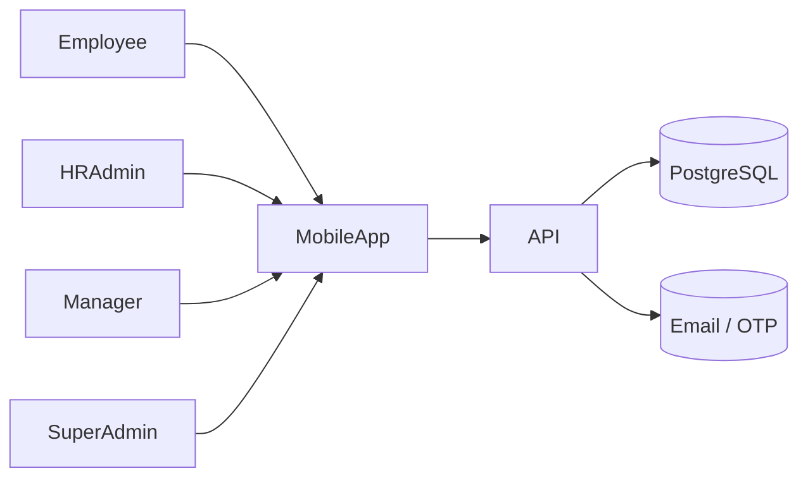

---

# 7. Architectural Layers

1. Presentation Layer (React Native)
2. Application Layer (FastAPI)
3. Domain / Service Layer
4. Repository Layer
5. Persistence Layer (PostgreSQL)

Each layer depends only on the layer immediately below it, reducing coupling and improving testability.

---

# 8. Repository Structure

The project follows a monorepo approach during the MVP to simplify development while maintaining clear module boundaries.

```text
hrms-portal/
│
├── apps/
│   ├── mobile/
│   └── backend/
│
├── docs/
│   ├── PRD.md
│   ├── Architecture.md
│   ├── Schema.md
│   ├── TRD.md
│   └── ...
│
├── scripts/
├── docker/
├── .github/
└── README.md
```

## Why Monorepo?

### Advantages

- Shared documentation
- Consistent versioning
- Unified CI/CD
- Easier onboarding
- Shared coding standards

Future extraction into separate repositories remains possible without changing the domain architecture.

---

# 9. Frontend Architecture

The mobile application follows a feature-based architecture instead of organizing code by file type.

```text
mobile/
│
├── src/
│   ├── app/
│   ├── navigation/
│   ├── modules/
│   │     ├── auth/
│   │     ├── attendance/
│   │     ├── leave/
│   │     ├── employee/
│   │     └── profile/
│   ├── components/
│   ├── services/
│   ├── hooks/
│   ├── utils/
│   └── theme/
```

### Benefits

- High cohesion
- Low coupling
- Independent feature growth
- Easier testing

---

# 10. Navigation Architecture

Navigation is organized around authenticated and unauthenticated flows.

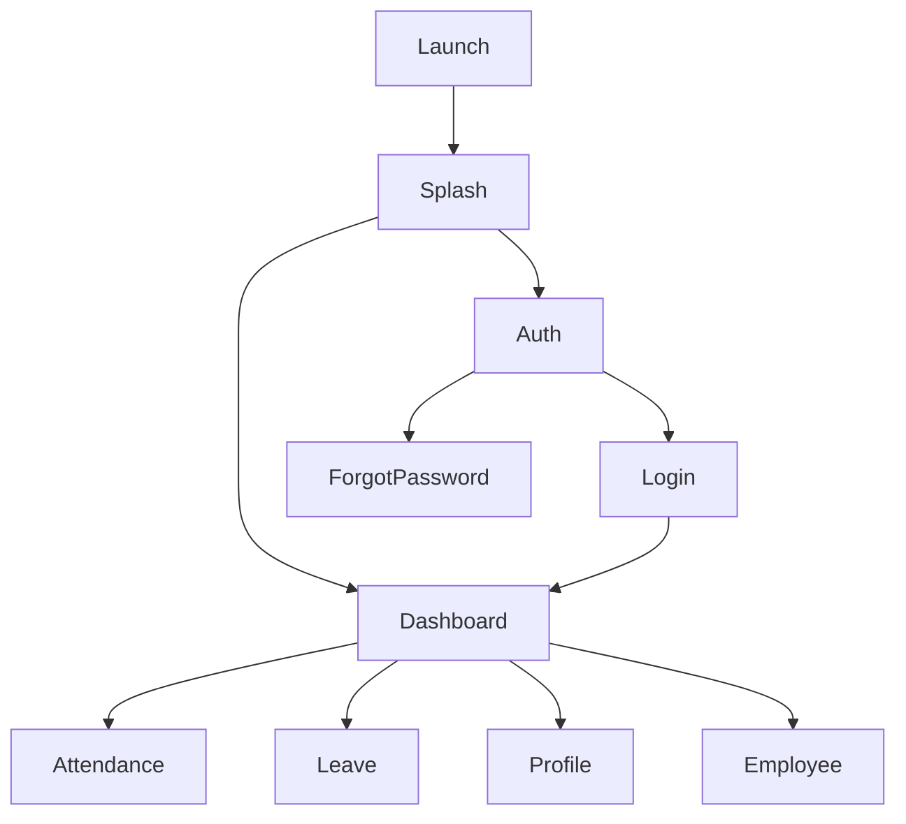

Navigation logic remains independent from business logic.

---

# 11. State Management Strategy

| Concern | Technology |
|----------|------------|
| Server State | TanStack Query |
| Client State | Zustand |
| Local Persistence | MMKV |
| Forms | React Hook Form |
| Validation | Zod |

## Guiding Rule

Server data should never be duplicated unnecessarily in local application state.

---

# 12. Offline-First Architecture

The mobile application is designed to continue operating during temporary network loss.

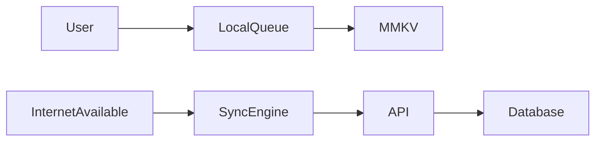

## Synchronization Principles

- Queue write operations locally.
- Retry automatically.
- Preserve operation order.
- Prevent duplicate submissions.
- Server remains the source of truth.

---

# 13. Request Lifecycle

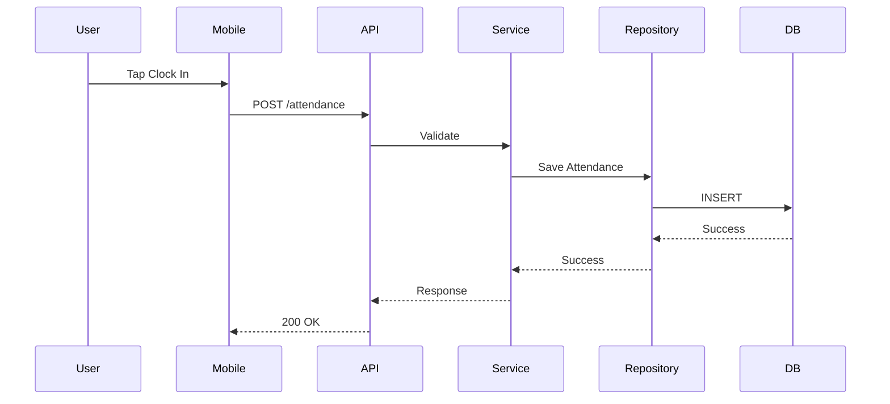

---

# 14. Frontend Design Constraints

- Business logic must not exist inside UI components.
- Screens communicate through services and hooks.
- API calls are centralized.
- Theme values are reusable.
- Components remain composable and testable.

---

# 15. Backend Architecture

The backend follows a layered, domain-oriented architecture that separates HTTP concerns from business logic and persistence.

```text
FastAPI
   │
Routers / Controllers
   │
Service Layer
   │
Repository Layer
   │
SQLAlchemy ORM
   │
PostgreSQL
```

## Objectives

- Thin API layer
- Rich business services
- Testable repositories
- Replaceable infrastructure
- Clear module ownership

---

# 16. Backend Project Structure

```text
backend/
│
├── app/
│   ├── core/
│   ├── api/
│   │   └── v1/
│   ├── modules/
│   │   ├── auth/
│   │   ├── attendance/
│   │   ├── employee/
│   │   ├── leave/
│   │   ├── company/
│   │   └── profile/
│   ├── db/
│   ├── middleware/
│   ├── schemas/
│   ├── services/
│   └── repositories/
│
├── alembic/
└── tests/
```

---

# 17. Module Boundaries

Each business capability owns its API routes, services, repositories, schemas, and domain logic.

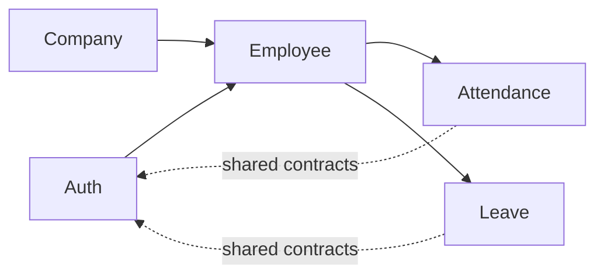

> Modules may communicate only through published service interfaces or shared domain contracts—not by directly accessing another module's persistence layer.

---

# 18. Layer Responsibilities

| Layer | Responsibility |
|--------|----------------|
| API | HTTP endpoints, validation, status codes |
| Service | Business rules and orchestration |
| Repository | Database interaction |
| ORM | Entity mapping |
| Database | Persistent storage |

Only adjacent layers communicate directly.

---

# 19. Dependency Injection

FastAPI's dependency injection system is used to provide:

- Database sessions
- Current authenticated user
- Current tenant
- Repository instances
- Service instances
- Configuration

Benefits:

- Easier unit testing
- Lower coupling
- Replaceable implementations
- Centralized lifecycle management

---

# 20. Repository Pattern

Repositories encapsulate persistence concerns.

```text
AttendanceService
        │
        ▼
AttendanceRepository
        │
        ▼
SQLAlchemy
        │
        ▼
PostgreSQL
```

Repositories should not contain business rules.

Business validation belongs in services.

---

# 21. API Versioning

All public APIs are versioned.

Example:

```text
/api/v1/auth/login
/api/v1/attendance
/api/v1/leave
```

Future breaking changes are introduced under `/api/v2` without impacting existing clients.

---

# 22. Middleware Pipeline

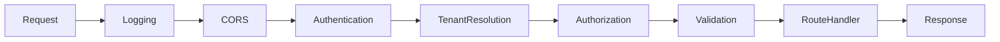

Middleware responsibilities:

- Request logging
- Correlation IDs
- Authentication
- Tenant resolution
- Authorization
- Exception handling

---

# 23. Error Handling Strategy

A centralized exception handler returns a consistent error contract.

Example response:

```json
{
  "success": false,
  "error": {
    "code": "ATTENDANCE_ALREADY_EXISTS",
    "message": "Attendance has already been recorded for today."
  },
  "trace_id": "generated-correlation-id"
}
```

Principles:

- Never expose internal stack traces.
- Use stable machine-readable error codes.
- Include correlation IDs for diagnostics.

---

# 24. Cross-Cutting Concerns

The following concerns are shared across all modules:

- Authentication
- Authorization (RBAC)
- Tenant isolation
- Audit logging
- Validation
- Observability
- Configuration
- Transactions

These are implemented centrally to ensure consistent behavior across the application.

---

# 25. Database Architecture

The HRMS Portal uses PostgreSQL with SQLAlchemy 2.x and Alembic. The database is designed around tenant isolation, transactional consistency, and future scalability.

## Design Principles

- UUIDs for internal identifiers
- Human-readable Employee IDs per company
- Foreign key integrity
- Soft delete where appropriate
- Auditability by default
- Indexed lookup columns

---

## Logical Data Flow

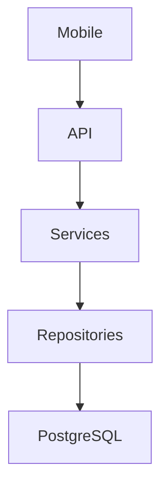

---

# 26. Multi-Tenant Strategy

Each company (tenant) owns its data.

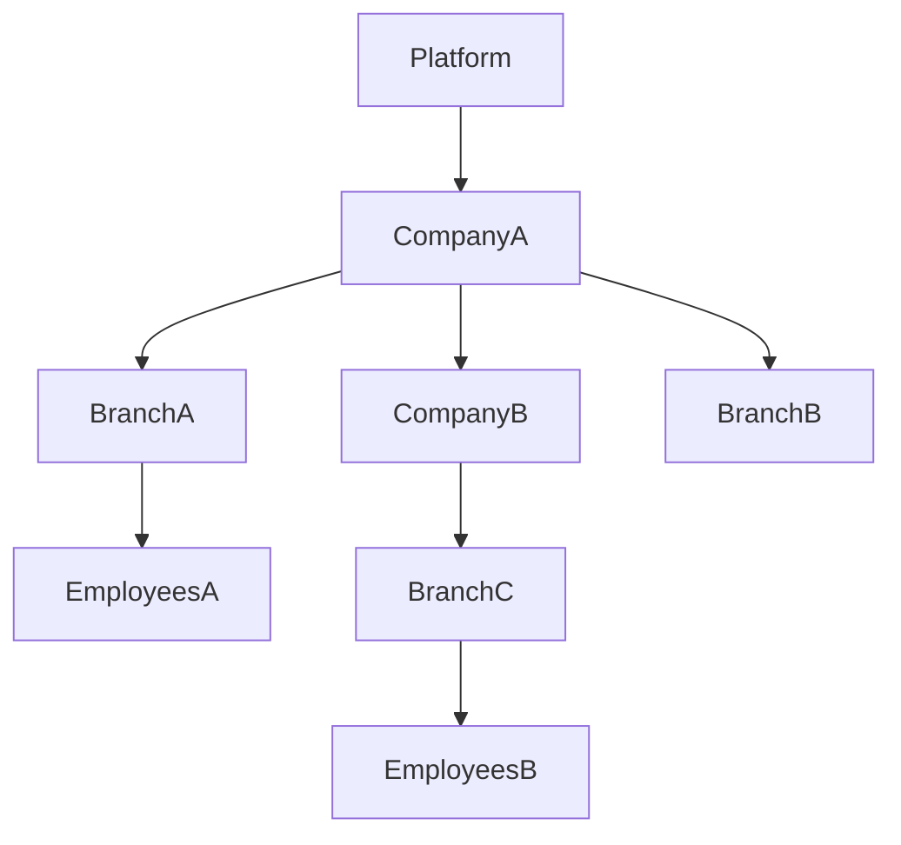

## Tenant Isolation Rules

- Every business record belongs to a company.
- Every request resolves the active tenant.
- Cross-tenant reads and writes are prohibited.
- Tenant filtering is enforced server-side.

---

# 27. Identifier Strategy

## Internal IDs

- UUID primary keys
- Never exposed for business operations where a friendly identifier exists

## Employee IDs

Format example:

```text
EMP00001
```

Uniqueness:

```text
UNIQUE(company_id, employee_id)
```

This allows different companies to have the same employee number without collisions.

---

# 28. Authentication Architecture

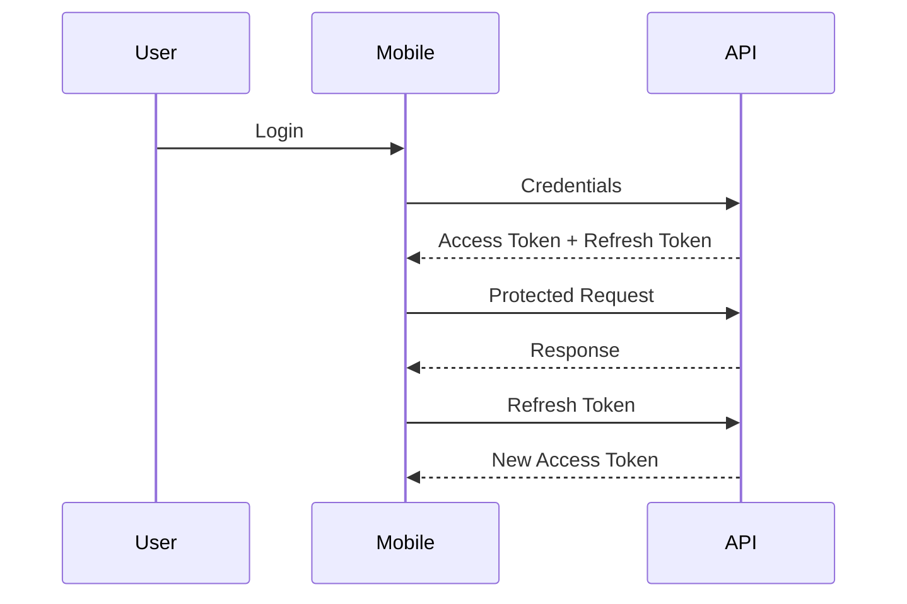

## Authentication Principles

- Short-lived access tokens
- Rotating refresh tokens
- Secure password hashing (bcrypt)
- Password reset via OTP
- Central authentication service

---

# 29. Authorization (RBAC)

Authorization decisions evaluate:

1. Identity
2. Tenant
3. Role
4. Permission
5. Resource

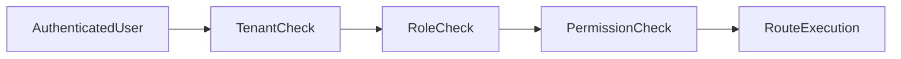

RBAC is enforced exclusively on the backend.

---

# 30. Security Architecture

## Core Controls

- HTTPS in production
- JWT authentication
- Refresh token rotation
- Rate limiting
- Input validation
- Parameterized queries
- Output sanitization
- Audit logging

## Secrets

Secrets are never stored in source control.

Configuration is environment driven.

---

# 31. Audit Logging

The following events must be captured:

- Login
- Logout
- Password changes
- Attendance corrections
- Leave approvals
- Employee creation
- Employee updates
- Role changes

Each audit record includes:

- Timestamp
- Actor
- Tenant
- Action
- Target
- Correlation ID

---

# 32. Data Protection

Sensitive data is protected through:

- Password hashing
- Encrypted transport (TLS)
- Principle of least privilege
- Database constraints
- Input validation
- Secure token storage on the client

---

# 33. Architecture Decision Record

## ADR-003 — UUID Primary Keys

**Status:** Accepted

### Decision

Use UUIDs as primary keys for all domain entities.

### Rationale

- Global uniqueness
- Easier replication
- Safer data merging
- Microservice-ready

### Trade-offs

Pros:
- Globally unique identifiers
- Better future federation

Cons:
- Less human readable
- Slightly larger indexes

Human-facing identifiers (e.g., Employee ID) solve the usability concern.

---

# 34. Infrastructure Architecture

The platform is designed to run on inexpensive infrastructure during the MVP while remaining cloud-agnostic and ready for enterprise deployment.

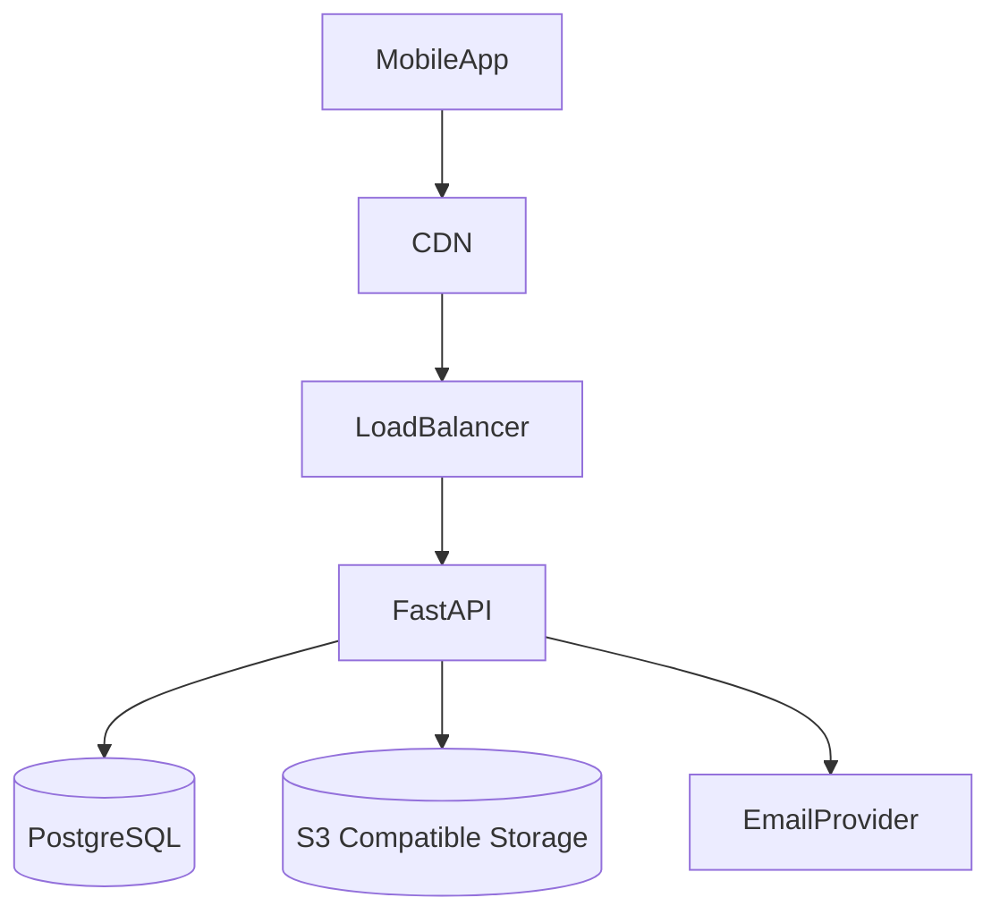

## Deployment Principles

- Stateless application servers
- Externalized configuration
- Immutable deployments
- Twelve-Factor App alignment
- Infrastructure as Code readiness

---

# 35. Containerization Strategy

## Development

- Docker Compose
- Hot reload
- Local PostgreSQL
- Local environment variables

## Production

- Container image
- Managed PostgreSQL
- External object storage
- Reverse proxy / load balancer

---

# 36. CI/CD Architecture

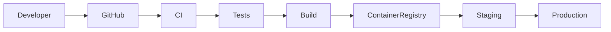

Pipeline stages:

1. Lint
2. Unit Tests
3. Security Checks
4. Build
5. Integration Tests
6. Deployment

---

# 37. Observability

## Logging

Capture:

- Requests
- Authentication events
- Business events
- Exceptions

## Metrics

- API latency
- Error rate
- Active users
- Queue length
- Database response time

## Tracing

Every request receives a correlation ID propagated across services.

---

# 38. Scalability Strategy

| Stage | Target |
|-------|--------|
| MVP | <1,000 employees |
| Growth | 10,000 employees |
| Enterprise | 100,000+ employees |
| Long Term | 1M+ employees |

Scaling priorities:

- Horizontal API scaling
- Read replicas
- Redis caching (future)
- Background workers
- CDN
- Object storage

---

# 39. Backup & Disaster Recovery

## Database

- Automated backups
- Point-in-time recovery (future)

## Storage

- Versioned object storage
- Replicated media

## Recovery Objectives

| Metric | Target |
|---------|---------|
| RPO | <15 minutes (future) |
| RTO | <1 hour (future) |

---

# 40. Future Microservice Migration

The modular monolith is intentionally designed so that each business capability can later become an independent service.

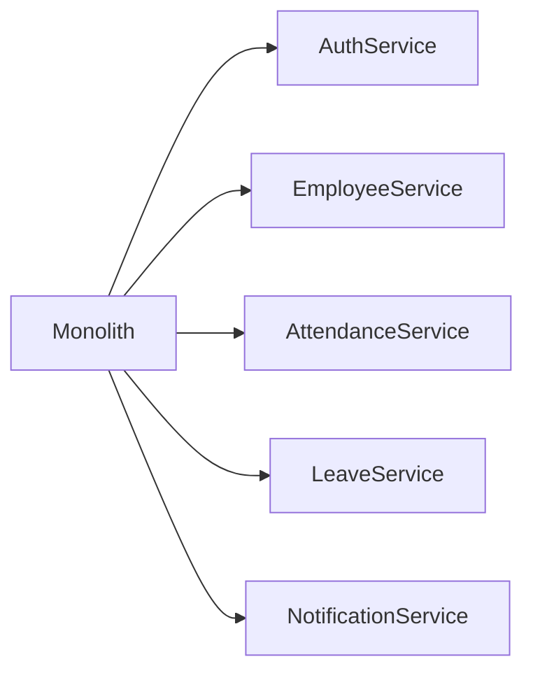

Migration order should prioritize modules with the highest scaling or deployment requirements.

---

# 41. Architecture Review Checklist

Before each release verify:

- Module boundaries respected
- Tenant isolation enforced
- RBAC validated
- Audit logging enabled
- Database migrations reviewed
- Secrets externalized
- Performance benchmarks met
- Security review completed

---

# 42. Cross-Document Traceability

| Document | Purpose |
|-----------|---------|
| PRD.md | Business requirements |
| Architecture.md | System blueprint |
| Schema.md | Database design |
| TRD.md | Technical implementation |
| Flow.md | User & system flows |
| Design.md | UI/UX system |
| Plan.md | Delivery roadmap |

---

# 43. Architecture Glossary

| Term | Meaning |
|------|---------|
| ADR | Architecture Decision Record |
| Tenant | A company using the platform |
| Repository | Persistence abstraction layer |
| Service | Business logic layer |
| MMKV | Local mobile key-value storage |
| Stateless | Server keeps no client session state |

---

# 44. Conclusion

The architecture of HRMS Portal has been intentionally designed to balance rapid MVP delivery with long-term maintainability and enterprise scalability.

Key characteristics include:

- Modular Monolith with clear module boundaries
- Mobile-first architecture
- Multi-tenant isolation
- Secure authentication and RBAC
- Offline-first synchronization
- Cloud-agnostic deployment
- Microservice-ready evolution path
- Strong observability and operational readiness

This document serves as the authoritative architectural reference for all future implementation work.

---

# End of Architecture.md

**Status:** Draft Complete (Version 1.0)
