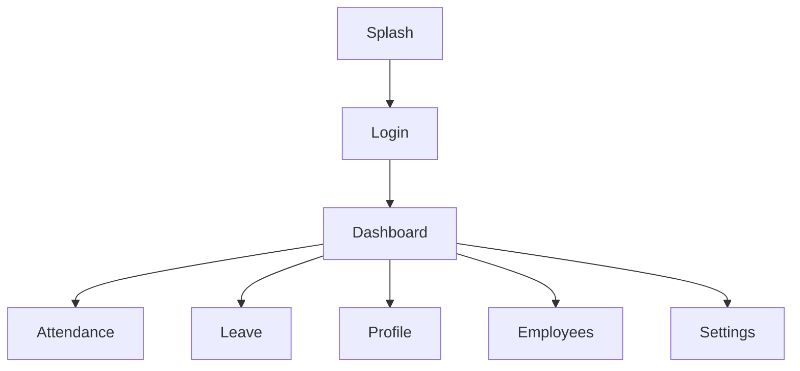

# Design.md

> **Document:** Design System & UI/UX Engineering Guide
> **Product:** HRMS Portal
> **Version:** 1.0 (Engineering Edition)
> **Status:** Draft

---

# 1. Purpose

This document defines the visual language, interaction principles, component library, navigation model, accessibility requirements, and design tokens for the HRMS Portal mobile application.

It is the single source of truth for designers and frontend developers.

Related Documents:

| Document | Purpose |
|-----------|---------|
| PRD.md | Product requirements |
| Architecture.md | Technical architecture |
| Flow.md | User & system flows |
| TRD.md | Engineering implementation |

---

# 2. Design Philosophy

The interface should feel:

- Professional
- Modern
- Fast
- Minimal
- Accessible
- Consistent

Inspirations:

- Linear
- Stripe Dashboard
- Notion
- Vercel

---

# 3. Design Principles

1. Content First
2. One Primary Action Per Screen
3. Progressive Disclosure
4. Consistent Navigation
5. Fast Feedback
6. Accessibility by Default

---

# 4. Information Architecture



---

# 5. Navigation System

Bottom Navigation

- Home
- Attendance
- Leave
- Profile

Drawer (Role Based)

- Employee Management
- Departments
- Branches
- Company Settings
- Audit Logs

---

# 6. Color System

## Primary

- Primary: #2563EB
- Success: #16A34A
- Warning: #F59E0B
- Error: #DC2626

## Neutral

- Background: #FFFFFF
- Surface: #F8FAFC
- Border: #E5E7EB
- Text Primary: #111827
- Text Secondary: #6B7280

Dark mode mirrors semantic colors with elevated contrast.

---

# 7. Typography

Primary Font

- Inter

Scale

| Token | Size |
|--------|------|
| Display | 32 |
| H1 | 28 |
| H2 | 24 |
| H3 | 20 |
| Body | 16 |
| Caption | 14 |
| Label | 12 |

---

# 8. Spacing System

Base Unit: 4px

| Token | Value |
|--------|-------|
| xs | 4 |
| sm | 8 |
| md | 16 |
| lg | 24 |
| xl | 32 |
| xxl | 48 |

---

# 9. Elevation & Radius

Radius

- Small: 8
- Medium: 12
- Large: 20

Cards use subtle elevation and generous whitespace.

---

# 10. Component Library

Core Components

- Button
- TextField
- PasswordField
- SearchBar
- Avatar
- Card
- Badge
- Snackbar
- Dialog
- Bottom Sheet
- Date Picker
- Empty State
- Skeleton Loader

Each component should expose consistent props and support light/dark themes.

---

# 11. Forms

- React Hook Form
- Zod validation
- Inline validation
- Disabled submit while processing
- Clear success and error feedback

---

# 12. Lists & Tables

Use FlashList for long datasets.

Patterns:

- Pull to refresh
- Infinite scroll (future)
- Search
- Filter
- Sort

---

# 13. Motion

Use Reanimated.

Guidelines

- Duration: 150–300 ms
- Smooth easing
- Motion reinforces state changes
- Avoid decorative animation

---

# 14. Accessibility

- Minimum touch target: 44x44 px
- Dynamic text support
- High contrast
- Semantic labels
- Screen reader compatibility
- Color is never the sole indicator

---

# 15. Responsive Behaviour

Support:

- Small phones
- Large phones
- Tablets (future)

Avoid fixed widths.

---

# 16. Screen Specifications

## Login

Components:

- Logo
- Email / Phone
- Password
- Forgot Password
- Login Button

Primary Action:
Login

---

## Dashboard

Widgets

- Attendance Status
- Leave Balance
- Quick Actions
- Recent Activity

---

## Attendance

Features

- Clock In
- Clock Out
- Today's Status
- History

---

## Leave

Features

- Apply Leave
- Leave Balance
- Pending Requests
- History

---

## Profile

- Personal Information
- Change Password
- Logout

---

# 17. Design Tokens

```json
{
  "font": "Inter",
  "spacing": 16,
  "radius": 12,
  "primary": "#2563EB",
  "background": "#FFFFFF"
}
```

These tokens should be mapped into NativeWind and shared across the application.

---

# 18. UX Quality Checklist

- Clear hierarchy
- Consistent spacing
- Reachable actions
- Accessible colors
- Fast loading states
- Empty states
- Error states
- Offline indicators

---

# 19. Future Design Extensions

- Company branding
- Theme customization
- Tablet layouts
- Desktop web design system
- Localization support
- RTL support

---

# 20. Conclusion

The HRMS Portal Design System prioritizes consistency, accessibility, scalability, and developer efficiency. By standardizing tokens, components, navigation, and interaction patterns, the application can grow without visual fragmentation while maintaining a polished user experience.

# End of Design.md
