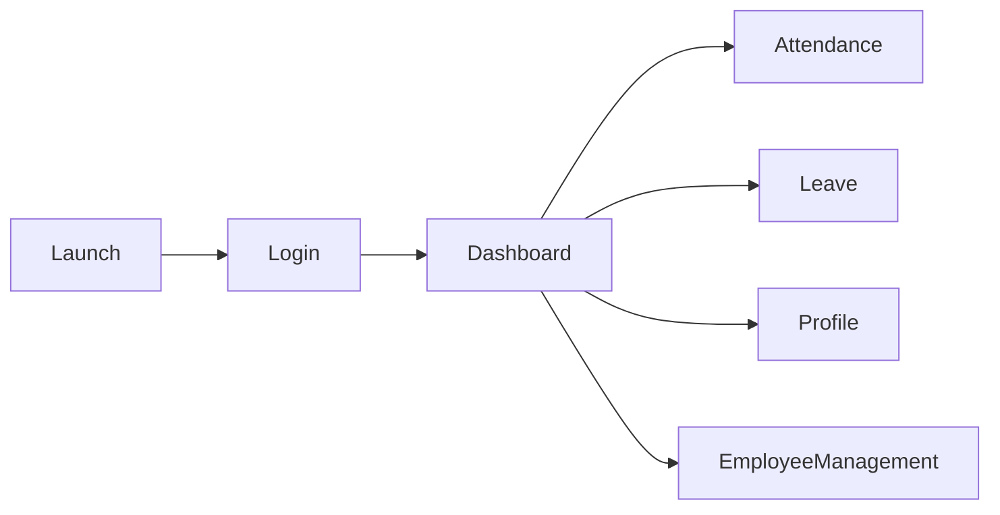
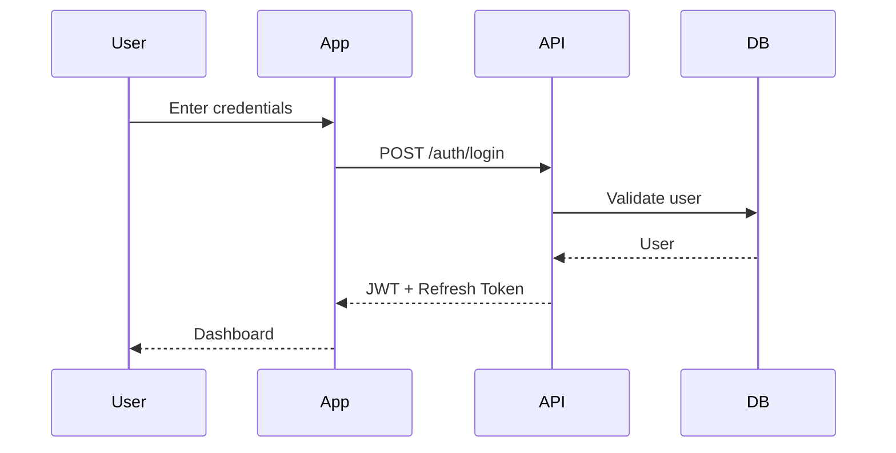
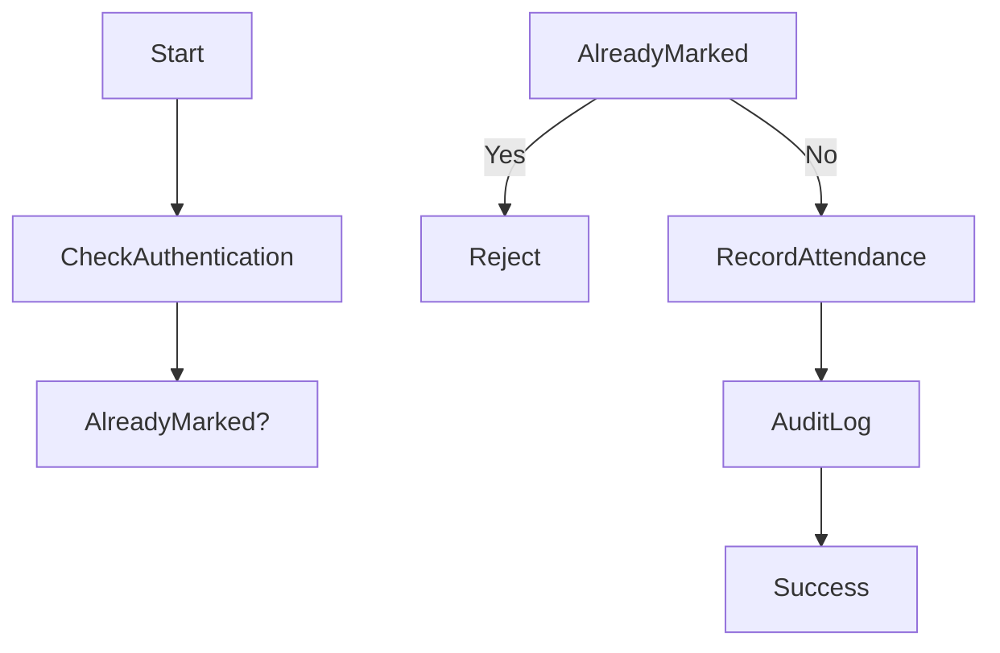
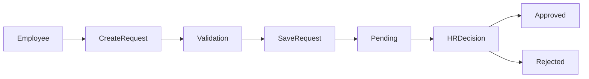
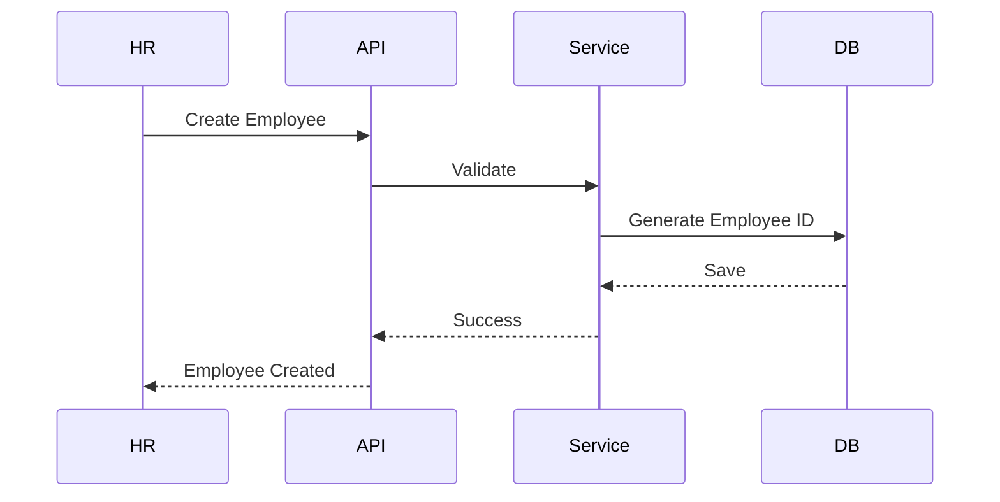
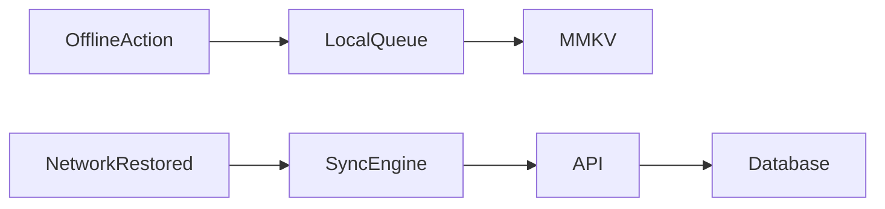
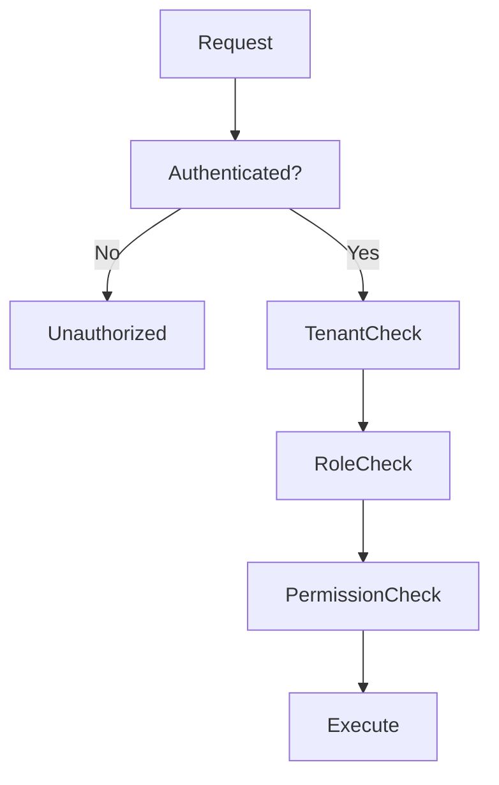
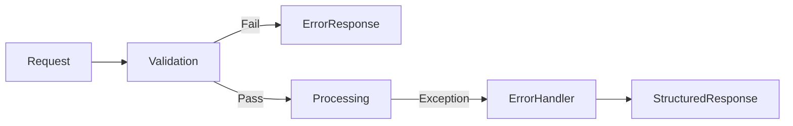
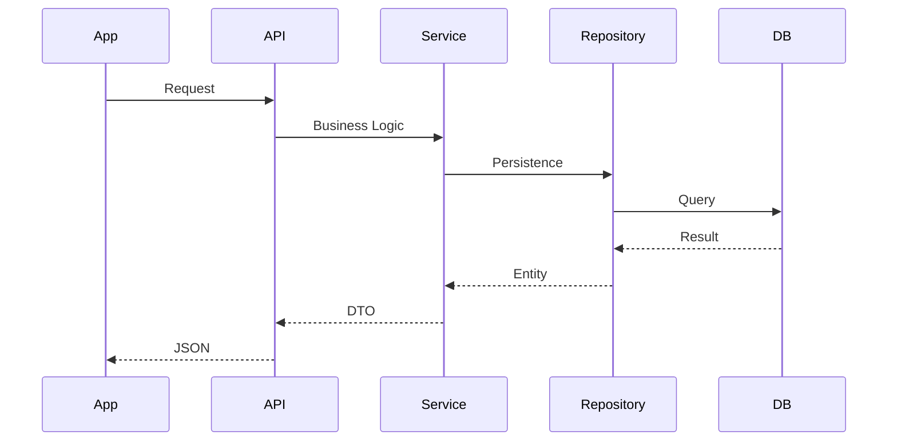

# Flow.md

> **Document:** System & User Flow Specification
> **Product:** HRMS Portal
> **Version:** 1.0 (Engineering Edition)
> **Status:** Draft

---

# 1. Purpose

This document defines the functional flows, user journeys, backend processing sequences, and state transitions for the HRMS Portal. It bridges the gap between the TRD and UI implementation.

Related documents:

| Document | Purpose |
|-----------|---------|
| PRD.md | Business requirements |
| Architecture.md | System architecture |
| Schema.md | Database model |
| TRD.md | Technical implementation |

---

# 2. High-Level User Journey

---

# 3. Authentication Flow

### Alternate Flows
- Invalid credentials
- Locked account
- Inactive employee
- Expired refresh token

---

# 4. Attendance Flow

Rules:
- One clock-in per day
- Server timestamp
- Offline requests queued
- Duplicate requests rejected

---

# 5. Leave Request Flow

State transitions:

PENDING → APPROVED

PENDING → REJECTED

PENDING → CANCELLED

---

# 6. Employee Creation Flow

Checks:
- Tenant isolation
- Unique employee ID
- Unique company email

---

# 7. Offline Synchronization

Conflict strategy:
- Server is source of truth
- Ordered replay
- Idempotent requests

---

# 8. RBAC Decision Flow

---

# 9. Error Flow

All responses include a correlation ID.

---

# 10. Screen Navigation Matrix

| Screen | Next Screens |
|---------|--------------|
| Splash | Login, Dashboard |
| Login | Dashboard, Forgot Password |
| Dashboard | Attendance, Leave, Profile, Employees |
| Attendance | Dashboard |
| Leave | Dashboard |
| Profile | Dashboard |

---

# 11. API Interaction Pattern

---

# 12. State Models

## Attendance

NOT_MARKED → CLOCKED_IN → CLOCKED_OUT

## Leave

PENDING → APPROVED

PENDING → REJECTED

PENDING → CANCELLED

## Employee

ACTIVE → INACTIVE

---

# 13. Future Flows

Reserved for:
- Notifications
- Payroll
- Shift scheduling
- Performance reviews
- Document approval
- Web portal synchronization

---

# 14. Traceability

| Flow | PRD Module | TRD Module |
|------|------------|------------|
| Login | Authentication | auth |
| Attendance | Attendance | attendance |
| Leave | Leave | leave |
| Employee | Employee | employee |

---

# End of Flow.md
