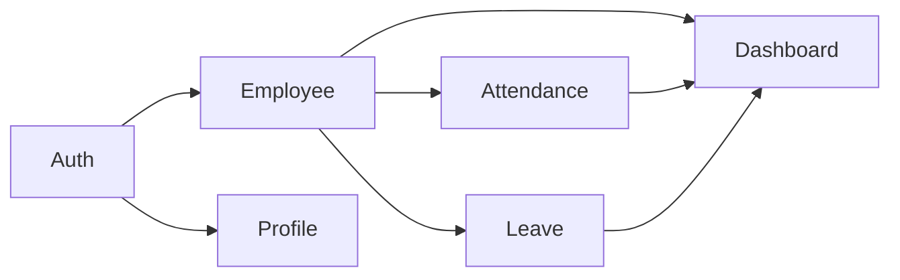

# Plan.md

> **Document:** Engineering Execution Plan
> **Product:** HRMS Portal
> **Version:** 1.0 (Engineering Edition)
> **Status:** Draft

---

# 1. Purpose

This document defines how the HRMS Portal will be planned, developed, tested, deployed, and maintained. It transforms the PRD, Architecture, Schema, TRD, Flow, and Design documents into an executable engineering roadmap.

---

# 2. Project Objectives

## Primary Goals

- Deliver a production-ready MVP.
- Maintain enterprise-grade architecture.
- Keep infrastructure cloud agnostic.
- Minimize technical debt.
- Enable future scaling with minimal code changes.

---

# 3. Project Phases

| Phase | Goal | Deliverables |
|--------|------|--------------|
| Phase 0 | Planning | Documentation, architecture approval |
| Phase 1 | Foundation | Repository, CI/CD, auth, database |
| Phase 2 | Core Modules | Employees, Attendance, Leave |
| Phase 3 | UX Completion | Dashboard, Profile, Offline Sync |
| Phase 4 | Stabilization | Testing, optimization, security |
| Phase 5 | Production | Deployment & monitoring |

---

# 4. Work Breakdown Structure (WBS)

```text
HRMS Portal
├── Planning
├── Mobile Application
│   ├── Authentication
│   ├── Employee
│   ├── Attendance
│   ├── Leave
│   ├── Dashboard
│   └── Profile
├── Backend
│   ├── API
│   ├── Services
│   ├── Repositories
│   └── Database
├── Testing
├── Deployment
└── Documentation
```

---

# 5. Module Dependency Graph



Implementation should follow dependency order to reduce rework.

---

# 6. Sprint Roadmap

| Sprint | Focus |
|---------|-------|
| Sprint 1 | Repository setup, tooling, CI/CD |
| Sprint 2 | Authentication |
| Sprint 3 | Employee Management |
| Sprint 4 | Attendance |
| Sprint 5 | Leave Management |
| Sprint 6 | Dashboard & Profile |
| Sprint 7 | Offline Sync & Polish |
| Sprint 8 | Testing & Release Candidate |

---

# 7. Git Strategy

## Branches

- main
- develop
- feature/*
- release/*
- hotfix/*

Workflow:

1. Create feature branch.
2. Commit frequently with meaningful messages.
3. Open Pull Request.
4. Code review.
5. Merge into develop.
6. Release to main.

---

# 8. Definition of Ready (DoR)

A task is ready when:

- Requirements are approved.
- UX available (if required).
- API contract defined.
- Dependencies identified.
- Acceptance criteria documented.

---

# 9. Definition of Done (DoD)

A task is complete only when:

- Feature implemented.
- Unit tests pass.
- Integration tests pass.
- Code reviewed.
- Documentation updated.
- No critical security issues.
- CI pipeline successful.

---

# 10. Quality Gates

Before merging:

- Formatting passes
- Lint passes
- Tests pass
- Static analysis passes
- Manual verification complete

---

# 11. Testing Plan

| Layer | Responsibility |
|--------|----------------|
| Unit | Services & utilities |
| Integration | API + database |
| UI | Critical user journeys |
| Regression | MVP release validation |

Priority flows:

- Login
- Attendance
- Leave
- Employee creation

---

# 12. Deployment Plan

## Development

- Local Docker
- Feature branches

## Staging

- Automated deployment
- QA validation

## Production

- Approved release
- Database migration
- Health verification
- Rollback plan available

---

# 13. Risk Register

| Risk | Impact | Mitigation |
|------|--------|------------|
| Scope creep | High | Strict change control |
| Free-tier limits | Medium | Cloud-agnostic design |
| Security issues | High | Reviews & testing |
| Schema changes | Medium | Alembic migrations |
| Performance regressions | Medium | Benchmarks & profiling |

---

# 14. Team Responsibilities

| Role | Responsibility |
|------|----------------|
| Product Owner | Priorities & acceptance |
| Engineering Lead | Technical direction |
| Mobile Developer | React Native |
| Backend Developer | FastAPI & PostgreSQL |
| QA | Testing |
| DevOps | CI/CD & deployment |

For a small team, one person may perform multiple roles while following the same responsibilities.

---

# 15. Release Checklist

- Documentation complete
- APIs stable
- Database migrations verified
- Security review complete
- Performance targets achieved
- Monitoring configured
- Backup strategy verified

---

# 16. Success Metrics

## Engineering

- CI success rate >95%
- Test coverage increasing over time
- Zero critical production defects before release

## Product

- Successful employee onboarding
- Reliable attendance recording
- Stable leave workflow

---

# 17. Post-Launch Plan

- Monitor application health
- Review user feedback
- Prioritize bug fixes
- Schedule incremental feature releases
- Conduct architecture reviews each major release

---

# 18. Long-Term Roadmap

## Version 1
Core HRMS

## Version 2
Notifications, Web Portal, Reports

## Version 3
Payroll, Documents, Shifts

## Version 4
AI Insights, Analytics, Integrations

## Version 5
Microservices, Multi-region deployment, Enterprise SSO

---

# 19. Cross-Document Traceability

| Planning Item | Reference |
|---------------|-----------|
| Requirements | PRD.md |
| Architecture | Architecture.md |
| Database | Schema.md |
| Technical Design | TRD.md |
| User Behaviour | Flow.md |
| UI System | Design.md |

---

# 20. Conclusion

This execution plan aligns engineering activities with the product vision and technical architecture. It provides a structured roadmap from planning through production while preserving scalability, maintainability, and quality.

By following this plan together with the accompanying documentation, the HRMS Portal can evolve from an MVP into a robust enterprise-ready platform without significant architectural rework.

# End of Plan.md
