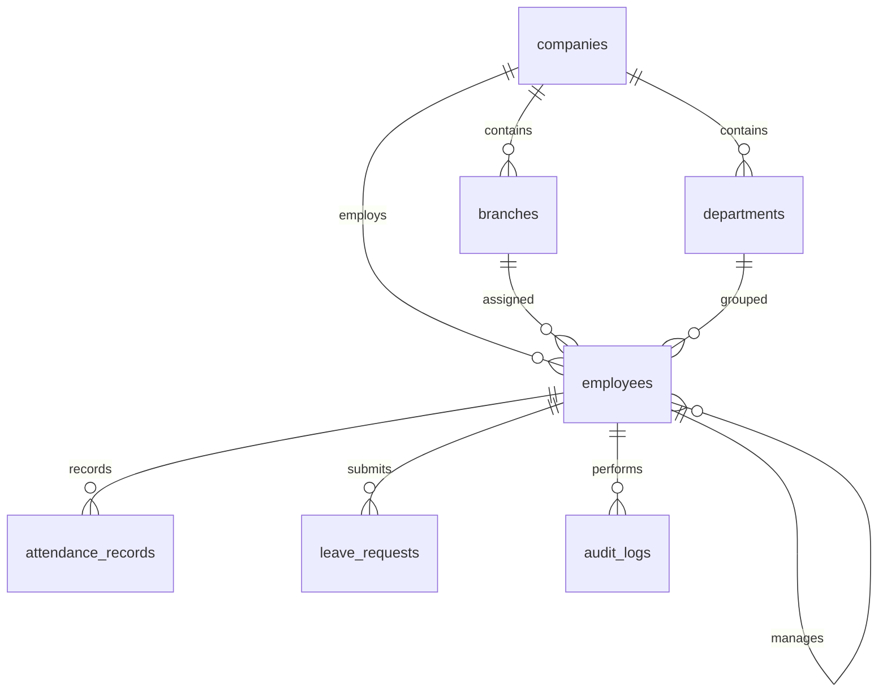

# Schema.md

> **Document:** Database Schema & Data Dictionary  
> **Product:** HRMS Portal  
> **Version:** 2.0 (Engineering Edition)  
> **Status:** Draft

---

# 1. Purpose

This document defines the logical and physical database design for the HRMS Portal. It is the authoritative reference for entity relationships, naming conventions, constraints, indexing, migrations, and future database evolution.

**Related Documents**

| Document | Purpose |
|-----------|---------|
| PRD.md | Business requirements |
| Architecture.md | System architecture |
| TRD.md | Technical implementation |

---

# 2. Database Design Principles

- PostgreSQL as the primary datastore
- UUID primary keys for all entities
- Company-based multi-tenancy
- Business identifiers separated from technical identifiers
- ACID transactions for business operations
- Auditability by default
- Soft deletion where business recovery is required
- Forward-compatible schema evolution through Alembic

---

# 3. Naming Standards

| Item | Convention | Example |
|------|------------|---------|
| Tables | plural_snake_case | attendance_records |
| Columns | snake_case | employee_id |
| PK | id | UUID |
| FK | entity_id | company_id |
| Index | ix_<table>_<column> | ix_employees_email |
| Unique | uq_<table>_<cols> | uq_employee_company |
| Foreign Key | fk_<table>_<ref> | fk_employee_company |

---

# 4. Entity Relationship Diagram



---

# 5. Core Tables

## companies

### Purpose

Represents an organization (tenant).

| Column | Type | Null | Default | Description |
|--------|------|------|---------|-------------|
| id | UUID | No | gen_random_uuid() | Primary key |
| code | VARCHAR(30) | No | - | Unique tenant code |
| name | VARCHAR(150) | No | - | Company name |
| timezone | VARCHAR(64) | No | UTC | Default timezone |
| created_at | TIMESTAMP | No | NOW() | Creation timestamp |
| updated_at | TIMESTAMP | No | NOW() | Last update |

Indexes

- uq_companies_code

---

## branches

| Column | Type | Description |
|--------|------|-------------|
| id | UUID | PK |
| company_id | UUID | FK companies |
| name | VARCHAR(100) | Branch name |
| address | TEXT | Postal address |

Indexes

- ix_branches_company

---

## departments

| Column | Type | Description |
|--------|------|-------------|
| id | UUID | PK |
| company_id | UUID | FK companies |
| name | VARCHAR(100) | Department |

---

## employees

### Business Rules

- UUID is internal identifier.
- Employee ID is human readable.
- Unique per company.

| Column | Type | Null | Description |
|--------|------|------|-------------|
| id | UUID | No | PK |
| company_id | UUID | No | FK |
| branch_id | UUID | No | FK |
| department_id | UUID | No | FK |
| manager_id | UUID | Yes | Self FK |
| employee_id | VARCHAR(20) | No | EMP00001 |
| first_name | VARCHAR(80) | No | First name |
| last_name | VARCHAR(80) | No | Last name |
| email | VARCHAR(150) | No | Work email |
| phone | VARCHAR(20) | Yes | Contact |
| employment_status | ENUM | No | ACTIVE / INACTIVE |
| joining_date | DATE | No | Join date |
| created_at | TIMESTAMP | No | Audit |
| updated_at | TIMESTAMP | No | Audit |
| deleted_at | TIMESTAMP | Yes | Soft delete |

Constraints

```sql
UNIQUE(company_id, employee_id);
UNIQUE(company_id, email);
```

---

## attendance_records

| Column | Type |
|--------|------|
| id | UUID |
| company_id | UUID |
| employee_id | UUID |
| attendance_date | DATE |
| clock_in | TIMESTAMP |
| clock_out | TIMESTAMP |
| working_minutes | INTEGER |
| status | ENUM |

Constraint

```sql
UNIQUE(company_id, employee_id, attendance_date);
```

---

## leave_requests

| Column | Type |
|--------|------|
| id | UUID |
| company_id | UUID |
| employee_id | UUID |
| leave_type | ENUM |
| start_date | DATE |
| end_date | DATE |
| reason | TEXT |
| status | ENUM |
| created_at | TIMESTAMP |

---

## audit_logs

Immutable history of security-sensitive actions.

| Column | Type |
|--------|------|
| id | UUID |
| company_id | UUID |
| actor_id | UUID |
| entity | VARCHAR |
| entity_id | UUID |
| action | VARCHAR |
| correlation_id | UUID |
| metadata | JSONB |
| created_at | TIMESTAMP |

---

# 6. ENUM Definitions

## employment_status

- ACTIVE
- INACTIVE

## leave_status

- PENDING
- APPROVED
- REJECTED
- CANCELLED

## attendance_status

- PRESENT
- ABSENT
- HALF_DAY
- LEAVE

---

# 7. Index Strategy

Primary indexes:

- company_id
- employee_id
- email
- attendance_date
- status
- created_at

Composite indexes:

- (company_id, employee_id)
- (company_id, attendance_date)
- (company_id, status)

Indexes should be reviewed using query plans before introducing additional composites.

---

# 8. Tenant Isolation

Every business table contains `company_id`.

Rules:

1. All queries filter by company.
2. Cross-tenant joins are prohibited.
3. Authorization validates tenant ownership before business logic executes.

---

# 9. Soft Delete Strategy

Soft delete applies to:

- employees
- branches
- departments

Historical business records such as attendance and audit logs are never deleted.

---

# 10. Data Retention

| Data | Policy |
|------|--------|
| Attendance | Permanent (configurable later) |
| Audit Logs | Permanent |
| Leave Requests | Permanent |
| Soft Deleted Employees | Recoverable |

---

# 11. Migration Standards

- Alembic manages all schema revisions.
- One logical change per migration.
- Downgrade path required.
- Destructive migrations require review.
- Production migrations executed through CI/CD.

---

# 12. Future Schema

Reserved modules:

- notifications
- payroll
- employee_documents
- holidays
- shifts
- assets
- recruitment
- performance_reviews

The current schema intentionally leaves room for these modules without changing existing identifiers or tenant strategy.

---

# 13. Architecture Alignment

This schema directly supports:

- Modular Monolith architecture
- Repository Pattern
- Multi-tenant SaaS
- Offline synchronization
- Future microservice migration
- Horizontal application scaling

---

# 14. Implementation Notes

- Use SQLAlchemy 2.x declarative models.
- Use Alembic for version control.
- Use PostgreSQL UUID type.
- Prefer JSONB only for truly dynamic metadata.
- Keep business logic out of database triggers where practical.

---

# End of Schema.md
