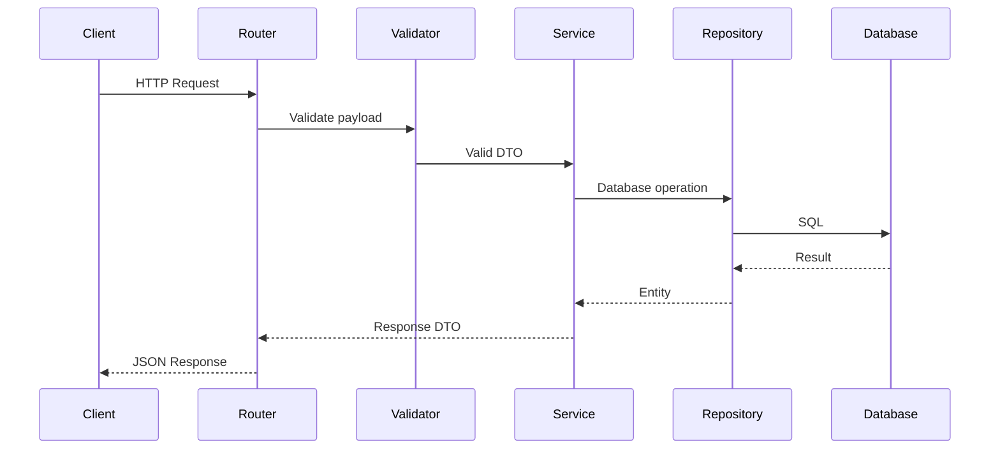

# TRD.md

> **Document:** Technical Requirements Document (Engineering Specification)
> **Product:** HRMS Portal
> **Version:** 1.0 (Engineering Edition)
> **Status:** Draft

---

# 1. Purpose

The Technical Requirements Document (TRD) converts the business requirements from the PRD and the architectural decisions from `Architecture.md` into implementation-ready engineering specifications.

This document defines **how the system will be built**, while the PRD defines **what will be built**.

---

# 2. Document Relationships

| Document | Responsibility |
|-----------|----------------|
| PRD.md | Business requirements |
| Architecture.md | System architecture |
| Schema.md | Database design |
| TRD.md | Technical implementation |
| Flow.md | User & system flows |

---

# 3. Technology Stack

## Frontend

- React Native (Expo Development Build)
- JavaScript (JSX)
- React Navigation
- Zustand
- TanStack Query
- React Hook Form
- Zod
- Axios
- MMKV
- NativeWind
- Reanimated

## Backend

- Python 3.13+
- FastAPI
- SQLAlchemy 2.x
- Alembic
- PostgreSQL
- Pydantic v2
- bcrypt
- JWT

Future-ready:

- Redis
- Celery
- S3-compatible object storage

---

# 4. Engineering Principles

- Thin controllers, rich services.
- Repository pattern for persistence.
- Dependency Injection for shared services.
- Feature-based modular architecture.
- API-first development.
- Server is the source of truth.
- Security by default.
- Backward-compatible API evolution.

---

# 5. Backend Module Specification

| Module | Responsibility |
|----------|----------------|
| auth | Authentication, tokens, password reset |
| employee | Employee lifecycle |
| attendance | Attendance operations |
| leave | Leave management |
| company | Tenant configuration |
| profile | Self-service profile |

Each module owns:

- API routes
- Schemas
- Services
- Repositories
- Tests

---

# 6. Request Lifecycle



---

# 7. API Standards

## URL Versioning

```text
/api/v1/auth
/api/v1/attendance
/api/v1/leave
```

## Success Response

```json
{
  "success": true,
  "data": {}
}
```

## Error Response

```json
{
  "success": false,
  "error": {
    "code": "VALIDATION_ERROR",
    "message": "Validation failed"
  },
  "trace_id": "uuid"
}
```

---

# 8. Validation Standards

- Client validation improves UX.
- Server validation is authoritative.
- Zod validates client forms.
- Pydantic validates API payloads.

Examples:

- Email format
- Phone format
- Required fields
- Date ranges
- Leave balance rules

---

# 9. Authentication Specification

Authentication supports:

- Email + Password
- Phone + Password
- Refresh Tokens
- Forgot Password
- OTP Verification

Implementation rules:

- bcrypt password hashing
- Short-lived access tokens
- Rotating refresh tokens
- Token revocation support

---

# 10. Authorization Specification

RBAC decisions evaluate:

1. Authentication
2. Tenant
3. Role
4. Permission
5. Resource ownership

Authorization is enforced on the backend for every protected endpoint.

---

# 11. Repository Contracts

Repositories are responsible only for persistence.

Example interface:

```python
AttendanceRepository
- create()
- update()
- get_by_employee()
- get_today()
- delete()
```

Business rules belong in services, not repositories.

---

# 12. Service Layer Responsibilities

Services:

- Execute business rules
- Manage transactions
- Coordinate repositories
- Publish domain events (future)
- Return DTOs

Services must not depend on HTTP-specific objects.

---

# 13. Transactions

Use database transactions for:

- Attendance creation
- Leave approval
- Employee onboarding
- Administrative updates

Partial writes are not permitted.

---

# 14. Security Requirements

- HTTPS in production
- JWT authentication
- Rate limiting
- Input validation
- Parameterized SQL
- Audit logging
- Secure secret management

---

# 15. Logging & Observability

Log:

- Requests
- Authentication events
- Business actions
- Exceptions

Every request includes a correlation ID.

---

# 16. Testing Strategy

| Layer | Test Type |
|---------|-----------|
| Services | Unit Tests |
| Repositories | Integration Tests |
| APIs | Endpoint Tests |
| End-to-End | User Journey Tests |

Coverage priorities:

- Authentication
- Attendance
- Leave
- Employee Management

---

# 17. Coding Standards

- Black formatting (Python)
- Ruff linting
- Type hints throughout backend
- Feature-based folders
- Descriptive function names
- No business logic in controllers

---

# 18. Performance Budgets

| Component | Target |
|------------|--------|
| API latency | <500 ms |
| DB query | <200 ms |
| App startup | <4 sec |
| Screen transition | <300 ms |

---

# 19. Future Enhancements

Reserved technical capabilities:

- Background jobs
- Push notifications
- Event bus
- Redis cache
- File storage abstraction
- Public APIs
- Webhooks

---

# 20. Traceability

| PRD Area | Technical Module |
|-----------|------------------|
| Authentication | auth |
| Attendance | attendance |
| Leave | leave |
| Employees | employee |
| Company Settings | company |

---

# 21. Definition of Done

A feature is complete only if:

- Implementation finished
- Tests pass
- Documentation updated
- Security reviewed
- API documented
- Performance acceptable
- Code reviewed
- CI pipeline passes

---

# End of TRD.md

This document should be used together with Architecture.md and Schema.md as the primary engineering reference during implementation.
